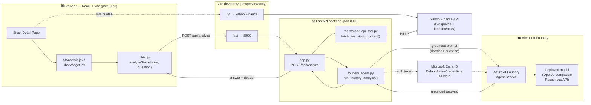
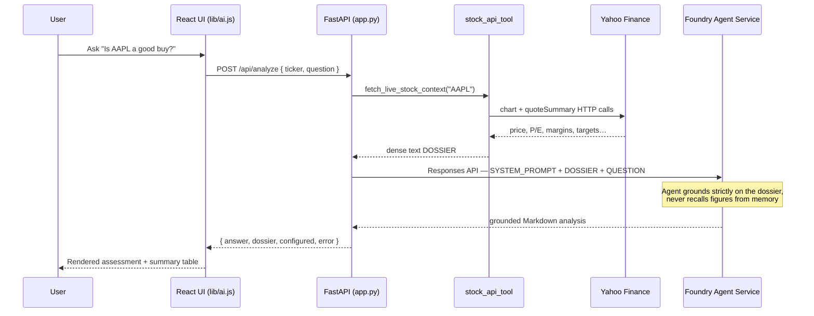
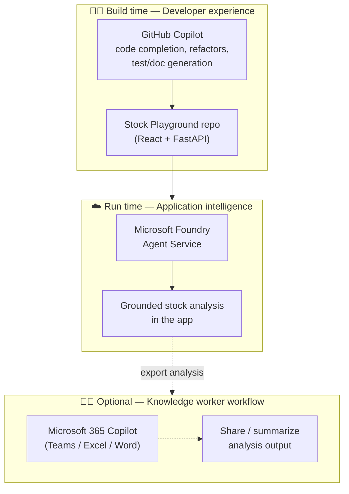

# Stock Playground — Architecture & Microsoft AI Integration

This document illustrates how **Stock Playground** uses **Microsoft Foundry (Azure AI
Foundry Agent Service)** as its runtime AI engine, and where **GitHub Copilot** and
**Microsoft 365 Copilot** fit into the solution's development and (optional) workflow.

> Stock Playground is a Robinhood-style portfolio UI (Vite + React 18) with an optional
> FastAPI backend that produces **grounded, on-demand equity analysis**. The frontend is
> fully functional on its own; the AI analysis panel is powered by a Foundry agent.

---

## 1. System architecture (runtime)

The core AI flow is a **retrieval-grounded agent** pattern: a free market-data API builds a
factual *dossier*, and a Microsoft Foundry agent answers the user's question grounded
**only** on that dossier.

### Request lifecycle (`POST /api/analyze`)

---

## 2. Where Microsoft Foundry is used

Microsoft Foundry is the **brain** of the AI analysis feature.

| Aspect | Detail |
| --- | --- |
| **Service** | Azure AI Foundry **Agent Service** (`azure-ai-projects`) |
| **Invocation** | OpenAI-compatible **Responses API** against a *named* agent |
| **Auth** | `DefaultAzureCredential` (Microsoft Entra ID / `az login`) |
| **Config** | `PROJECT_CONNECTION_STRING` (project endpoint) + `FOUNDRY_RESEARCH_AGENT_ID` (agent name) |
| **Grounding** | A live Yahoo dossier is injected per request; the agent is instructed to use **only** those figures |
| **Output contract** | Structured Markdown assessment + a canonical summary table (enforced in `foundry_agent.py`) |
| **Graceful degradation** | If Foundry env vars are unset, the API returns a clear "not configured" message and the rest of the app keeps working |

Key code: [`backend/foundry_agent.py`](../backend/foundry_agent.py) — builds the grounded prompt,
authenticates, calls `project.get_openai_client(...).responses.create(...)`, and finalizes the answer.

---

## 3. Where GitHub Copilot & Microsoft 365 Copilot fit

- **GitHub Copilot — development accelerator.** Used while authoring the React components,
  the FastAPI backend, the Yahoo dossier builder, and these docs (code completion, inline
  refactors, and boilerplate/test/doc generation).
- **Microsoft Foundry — runtime intelligence.** The deployed agent that produces the grounded
  financial assessment surfaced in the app's AI panel. *(Primary Microsoft AI integration.)*
- **Microsoft 365 Copilot — optional knowledge-worker layer.** A natural extension point: the
  Markdown assessment the app returns can be surfaced/summarized inside Teams, Word, or Excel
  via M365 Copilot for sharing and follow-up. *(Extension, not currently wired in code.)*

---

## 4. Component reference

| Layer | File(s) | Responsibility |
| --- | --- | --- |
| Frontend AI panel | `src/components/AIAnalysis.jsx`, `src/components/ChatWidget.jsx` | Collect the question, render the grounded answer |
| Frontend API client | `src/lib/ai.js` | `analyzeStock(ticker, question)` → `POST /api/analyze` |
| Dev proxy | `vite.config.js` | `/api` → `:8000`, `/yf` → Yahoo (dev/preview only) |
| API surface | `backend/app.py` | `GET /api/health`, `POST /api/analyze` |
| Data dossier | `backend/tools/stock_api_tool.py` | Build dense text dossier from live Yahoo data |
| Foundry agent | `backend/foundry_agent.py` | Ground + invoke the Microsoft Foundry agent |

> **Deployment note:** the `/api` and `/yf` proxies exist only under `vite dev` / `vite preview`.
> A static production build needs a real proxy or serverless function for both, and live quotes
> require Yahoo Finance reachable at runtime.
</content>
</invoke>
